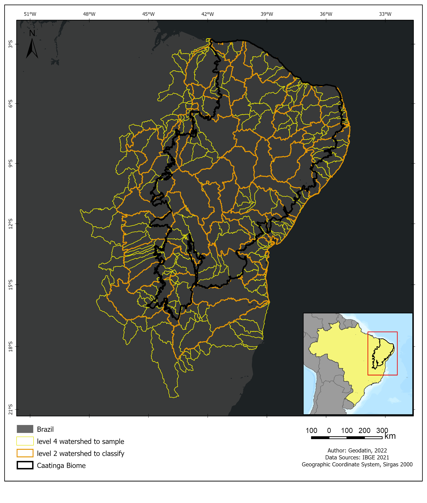

# Mapping methodology of Land Used Land Cover mapping of 37 years on project Mapbiomas/ Biome Caatinga

In this repository we share a set of scripts that were used for the construction of the use and coverage maps of the Caatinga biome in the 7.0 collection of the Mapbiomas project. The Maps were created from the Mapbiomas mosaics. Each mosaic corresponding to a year within the 1985-2021 series was trimmed by the limits of Hydrographic Basins of Brazil at level 2, figure 1. Some hydrographic basins were raised to level 3 in order to facilitate the Google Earth Engine api calculations.


<p align="center">
    
</p>
Figure 1: Limits of hydrographic basins in levels 2 and 4, and and limit of caatinga biome.

The classes produced in this work correspond to level 3, available in:

> https://mapbiomas.org/codigos-de-legenda?cama_set_language=pt-BR


The category of class of land cover are listed below with the nomenclature, the class number  and the color corresponding in the serie maps .

<p align="center">
    
</p>

Table 1: Legend of the classified classes.

The flow of the mapping process is explained in figure 2 below:

<p align="center">
    
</p>
Figure 2: Classification process of Mapbiomas current collection (1985-2021) in the Caatinga Biome.

### SUMMARY
* -- Collection of training samples
* -- Feature selection
* -- Parameter analysis for Random Forest
* -- Classification of Images Collection with Random Forest
* -- Validation of Results

## Building mosaic Landsat 
The mosaic was building with the Landsat images Collections 2 ST products. This collections 2 of Landsat was created with the Landsat Ecosystem Disturbance Adaptive Processing System (LEDAPS) algorithm (version 3.4.0) available on GEE. The mosaic was saved in the asset project Mapbiomas with all processing to get the data cleaned, it is accessed by path “projects/nexgenmap/MapBiomas2/LANDSAT/BRAZIL/mosaics-2”. This mosaic has 119 spectral bands between spectral indexes, fractions from spectral unmixing and descriptive statistics calculated by period  dry and wet, and the time serie of mosaic have 37 year. The access can be load this:
```
python

class ClassMosaic_indexs_Spectral(object):

    # default options
    options = {
        "bandas": ['B2', 'B3', 'B4', 'B8', 'B9', 'B11', 'B12', 'MSK_CLDPRB'],
        'classMapB': [3, 4, 5, 9, 12, 13, 15, 18, 19, 20, 21, 22, 23, 24, 25, 26, 29, 30, 31, 32, 33,
                      36, 39, 40, 41, 46, 47, 48, 49],
        'classNew':  [3, 4, 3, 3, 12, 12, 15, 18, 18, 18, 18, 22, 22, 22, 22, 33, 29, 22, 33, 12, 33,
                      18, 18, 18, 18, 18, 18, 18, 4],
        'asset_baciasN4': 'projects/mapbiomas-workspace/AMOSTRAS/col7/CAATINGA/bacias_hidrografica_caatingaN4',
        'outAsset': 'projects/mapbiomas-workspace/AMOSTRAS/col7/CAATINGA/ROIsXBaciasBalv7/',
        'assetMapbiomasGF': 'projects/mapbiomas-workspace/AMOSTRAS/col6/CAATINGA/classificacoes/classesV5',
        'assetMapbiomas': 'projects/mapbiomas-workspace/public/collection6/mapbiomas_collection60_integration_v1',
        'asset_mosaic_mapbiomas': 'projects/nexgenmap/MapBiomas2/LANDSAT/BRAZIL/mosaics-2',
        "anoIntInit": 1985,
        "anoIntFin": 2021,
    }
    lst_properties = arqParam.allFeatures
    def __init__(self, lst_year):

        self.imgMosaic = ee.ImageCollection(self.options['asset_mosaic_mapbiomas']).filter(
            ee.Filter.eq('biome', 'CAATINGA'))

    .
    .
    .

```

## Collection of training samples

- *The collection of training samples* is divided into 2 important parts:
* - sampling methods 
* - removal of points outliers

*Reference samples* for classification are collected from the map series in the most recent collection of Mapbiomas, in this case colection 5.0. To collect points with a certain level of veracity confidence per map year, a layer of stable pixels with 5 years of maps is created. Two years before the year under study and two years later. The window in time can be enlarged or reduced to 3, but it always matters. For this, modify the input parameters in the dictionary stop in the script pontos_SemBalanceamento.py.
```python
param = {
    'bioma': "CAATINGA", #nome do bioma setado nos metadados
    'asset_bacias': "projects/mapbiomas-arida/ALERTAS/auxiliar/bacias_hidrografica_caatinga",
    'asset_IBGE': 'users/SEEGMapBiomas/bioma_1milhao_uf2015_250mil_IBGE_geo_v4_revisao_pampa_lagoas',    
    'outAsset': 'projects/mapbiomas-workspace/AMOSTRAS/col6/CAATINGA/ROIsXBaciasBal2/',
    'assetMapbiomasP': 'projects/mapbiomas-workspace/AMOSTRAS/col5/CAATINGA/classificacoes/classesV11',
    'asset_Mosaic': 'projects/mapbiomas-workspace/MOSAICOS/workspace-c3',
    'asset_mosaic_norm': 'projects/nexgenmap/MapBiomas2/LANDSAT/mosaics-normalized',
    'classMapB': [3, 4, 5, 9,12,13,15,18,19,20,21,22,23,24,25,26,29,30,31,32,33,36,37,38,39,40,41,42,43,44,45],
    'classNew': [3, 4, 3, 3,12,12,21,21,21,21,21,22,22,22,22,33,29,22,33,12,33, 21,33,33,21,21,21,21,21,21,21],
    'janela': 5,
    'lsClasse': [3,4,12,21,22,33,29],
    'lsPtos': [1500,1500,1500,1500,1500,1500,1500] 
    'anoInicial': 1985,
    'anoFinal': 2020
}
```

Modify the file that records the collected basins:
arqFeitos = open("registros/lsBaciasROIsfeitasBalanceadas.txt", 'r')