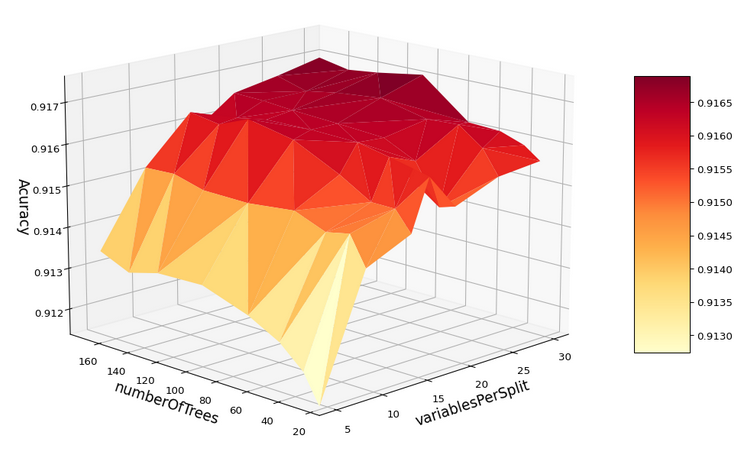

# Mapping methodology of Land Used Land Cover mapping of 37 years on project Mapbiomas/ Biome Caatinga

In this repository we share a set of scripts that were used for the construction of the use and coverage maps of the Caatinga biome in the 7.0 collection of the Mapbiomas project. The Maps were created from the Mapbiomas mosaics. Each mosaic corresponding to a year within the 1985-2021 series was trimmed by the limits of Hydrographic Basins of Brazil at level 2, figure 1. Some hydrographic basins were raised to level 3 in order to facilitate the Google Earth Engine api calculations.


<p align="center">
    
</p>
Figure 1: Limits of hydrographic basins in levels 2 and 4, and and limit of caatinga biome.

The classes produced in this work correspond to level 3, available in:

> https://mapbiomas.org/codigos-de-legenda?cama_set_language=pt-BR


The category of class of land cover are listed below with the nomenclature, the class number  and the color corresponding in the serie maps .

<p align="center">
    
</p>

Table 1: Legend of the classified classes.

The flow of the mapping process is explained in figure 2 below:

<p align="center">
    
</p>
Figure 2: Classification process of Mapbiomas current collection (1985-2021) in the Caatinga Biome.

### SUMMARY
* -- Collection of training samples
* -- Feature selection
* -- Parameter analysis for Random Forest
* -- Classification of Images Collection with Random Forest
* -- Validation of Results

## Building mosaic Landsat 
The mosaic was building with the Landsat images Collections 2 ST products. This collections 2 of Landsat was created with the Landsat Ecosystem Disturbance Adaptive Processing System (LEDAPS) algorithm (version 3.4.0) available on GEE. The mosaic was saved in the asset project Mapbiomas with all processing to get the data cleaned, it is accessed by path “projects/nexgenmap/MapBiomas2/LANDSAT/BRAZIL/mosaics-2”. This mosaic has 119 spectral bands between spectral indexes, fractions from spectral unmixing and descriptive statistics calculated by period  dry and wet, and the time serie of mosaic have 37 year. The access can be load this:
```
python

class ClassMosaic_indexs_Spectral(object):

    # default options
    options = {
        "bandas": ['B2', 'B3', 'B4', 'B8', 'B9', 'B11', 'B12', 'MSK_CLDPRB'],
        'classMapB': [3, 4, 5, 9, 12, 13, 15, 18, 19, 20, 21, 22, 23, 24, 25, 26, 29, 30, 31, 32, 33,
                      36, 39, 40, 41, 46, 47, 48, 49],
        'classNew':  [3, 4, 3, 3, 12, 12, 15, 18, 18, 18, 18, 22, 22, 22, 22, 33, 29, 22, 33, 12, 33,
                      18, 18, 18, 18, 18, 18, 18, 4],
        'asset_baciasN4': 'projects/mapbiomas-workspace/AMOSTRAS/col7/CAATINGA/bacias_hidrografica_caatingaN4',
        'outAsset': 'projects/mapbiomas-workspace/AMOSTRAS/col7/CAATINGA/ROIsXBaciasBalv7/',
        'assetMapbiomasGF': 'projects/mapbiomas-workspace/AMOSTRAS/col6/CAATINGA/classificacoes/classesV5',
        'assetMapbiomas': 'projects/mapbiomas-workspace/public/collection6/mapbiomas_collection60_integration_v1',
        'asset_mosaic_mapbiomas': 'projects/nexgenmap/MapBiomas2/LANDSAT/BRAZIL/mosaics-2',
        "anoIntInit": 1985,
        "anoIntFin": 2021,
    }
    lst_properties = arqParam.allFeatures
    def __init__(self, lst_year):

        self.imgMosaic = ee.ImageCollection(self.options['asset_mosaic_mapbiomas']).filter(
            ee.Filter.eq('biome', 'CAATINGA'))

    .
    .
    .

```

## Collection of training samples

- *The collection of training samples* is divided into 2 important parts:
* - sampling methods 
* - removal of points outliers

*Reference samples* for classification are collected from the map series in the most recent collection of Mapbiomas, in this case colection 6.0. To collect points with a certain level of veracity confidence per map year, a layer of stable pixels with 5 years of maps is created. Two years before the year under study and two years later. The sampling process for areas large in google earth engine (GEE) is a computationally expensive task, that is why in this work small areas were selected at level 4 watershed. The level 4 watershed has 320 regions, then this sampling process was automated using the api python of GEE. For this, modify the input parameters in the dictionary in the script pontos_balanceadosv2.py.

```python
for item in lsBacias[:]:

    if item not in baciasFeitas:

        print("fazendo bacia " + item)

        baciaTemp = ftcol_bacias.filter(
            ee.Filter.eq('nunivotto3', item)).first()
        # geobacia, colAnos, nomeBacia, dict_nameBN4
        objetoMosaic_exportROI.iterate_bacias(baciaTemp.geometry(
        ),  newColectAnos[indexIni: indexFin + 2], item,  dict_lstBacias)

        print("salvando ROIs bacia: << {} >>".format(item))
```

Each watershed on level N2 is called the object *ClassMosaic_indexs_Spectral* and  in this class each points sample for year mosaic is collected and exported by watershed level N4. The training sample set is exported by using the mosaic per year and the Mapbiomas layer with the object *ClassMosaic_indexs_Spectral*. Then the function "iterate_basins" exports the points with values of the 119 mosaic bands together with corresponding class for each level 4 basin.After files were collected these are joined by watershed level N2 metadata and saved in other asset id to other analyzes. 

Remove Outliers is a good technique for cleaning data in the preprocessing step. The outliers pixels of each coverage class are removed using a clustering algorithm “ee.Clusterer.wekaLVQ" implemented in the Google Earth Engine of the article  KOHONEN, 2003.


> ==> run: python filtroOutlierAmostras.py

The parameters of cluster was:
```python
    'pmtClustLVQ' : { 
        'numClusters': 8, 'learningRate': 0.000005, 'epochs': 800
        }
```


<p align="center">
    
</p>
Figure 3: Visualization of the result of removing outliers before and after.


## Feature selection

For the construction of the land coverage maps of the Mapbiomas project, annual analytical mosaics are used. The selection of the bands to be used in a classification by Machine Learning is a fundamental process for a good performance of the classification algorithm as well as decreasing the processing time. For this analysis, all points previously collected are downloaded from asset GEE to drive google, in CSV format. These have information in the point from each of the bands in the mosaic. The method to know which bands of the mosaic are most important is used the function [feature_importances_] of the model implemented in the python sklearn library, for more information [visit scikit-learn](https://scikit-learn.org/stable/modules/generated/sklearn.ensemble.RandomForestClassifier.html?highlight=sklearn%20ensemble#sklearn.ensemble.RandomForestClassifier):

A first feature space selection strategy was to filter out all the features that were highly correlated with each other. With this step all highly correlated spectral bands would be considered redundant. See figure 4. 

<p align="center">
    
</p>
Figure 4: Visualization of correlation matrix of feature space.

```python
==>  run: python filtroReducerLargeROIsbyClass.py
```

In feature analysis, it is important to understand how variables are distributed in space. Visual exploration is an essential component of data analysis, it allows you to visually arrive at intuitions and hypotheses about the structure and distribution in space. Visual analysis allows you to develop some approaches to obtain or quantify such an understanding of the data, KEIM <i> et al. <\i> 2010. Pair combinations help a bit to visually understand the complexity of separating classes within the space used. See figure 5. 

<p align="center">
    
</p>
Figure 5: Visualization scatter plot of samples by feature pairs .

In this collection the importance analysis was  implemented by each set of samples and by each year. The scripts iterate through each of the csvs joined and save each set of features in a dictionary where the key is the combination watershed name and year, this file with feature importances information is saved in type file json. All *.csv files must be in the same folder. See figure 6.

<p align="center">
    
</p>
Figure 5: Visualization bar plot of features importance.

The scrips was implemented in de scripts:

```python
==>  run: python getpmtos_featureImportance_years.py
==> loadding getpmtos_featureImportance_years.py
==> output file registroYear_FeatsImp.json
```
## Parameter analysis for Random Forest

The Random Forest Classifier is trained using bootstrap aggregation, where each constructed tree is adjusted based on a bootstrap sample of the training observations and a random set of size bands fixed in the input parameters. 
The out-of-bag error (OOB) is the average error for each calculated using predictions from trees that do not contain in their respective bootstrap sample. This allows the Random Forest Classifier to be adjusted and validated during the first training, and to compare with other sets of parameters. In this analysis, the parameter to modify was the 'number of trees' and 'variables per split'. By each sample colected by year and hydrographic basin is calculating a combination of parameter of Random Forest and is it calculate the accuracy. This accuracy is ploting in space of 3D dimension, see figure  6.

<p align="center">
    
</p>
Figure 6: Plot of accuracy of combination of parameters Random Forest.
```python
==>  TesteStressRandomForest.py
```
For more information visit [scikit-learn](https://scikit-learn.org/stable/auto_examples/ensemble/plot_ensemble_oob.html#sphx-glr-auto-examples-ensemble-plot-ensemble-oob-py):

This plot shows that parameters less than 20 trees and less than 5 variables per split represents a combination of bad parameters for the classifier. Then the size of trees to train the classifier was greater than 150. For some set points by watershed level N2 the parameters of Random Forest was :

```python
'pmtRF': {
        'numberOfTrees': 265, 
        'variablesPerSplit': 25,
        'minLeafPopulation': 1,
        'bagFraction': 0.8,
        'seed': 0
    },
```


## Validation of Results
Validation of a historical series of maps is a complex process that requires several ways to review the data. In order to generate a one-year map millions of pixels are classified, these classified pixels need a visual inspection and if the experts agree to move on to another step, which is the calculation of the accuracy indexes and analysis of the series of areas by class. The latter analysis helps to detect abrupt errors that could be overlooked in the analyzes per year. If the result of the evaluation is not satisfactory, it is necessary to return to the step of reviewing the parameters, samples and classifying again. The reference points were referenced by the LAPIG / UFG team on the platform developed for this activity (tvi.lapig.iesa.ufg.br), for more information visit the [ATBD of mapbiomas](https://mapbiomas-br-site.s3.amazonaws.com/ATBD_Collection_5_v1.pdf)


#### accuracy calculation
Modify the parameters, data asset and if the map is in Image or ImageCollection format from GEE
```python  
    param= {  
        'assetCol6': 'projec…',
        "amostrarImg": True
    }
```
> ==>  run: python getCSVsPointstoAcc.py

all points tables per year will be saved in the 📂 "ocorrencia" folder on your google drive. Once you have all the tables saved on your computer, you must change the path in the next script and run.

> ==>  run: python accuracy.py 

#### area calculation by class in each year
The calculation of area by class is calculated for each watershed and stored in a single CSV table. The input parameters to be modified:
```python
param = {
    'inputAsset': 'projects/..'
    classMapB': [3, 4, 5, 9,12,13,15,18,19,20,21,22,23,24,25,26,29,30,31,32,33,36,39,41],
    'classNew': [3, 4, 3, 3,12,12,21,21,21,21,12,22,22,22,22,33,29,22,33,12,33,21,21,21],
    'collection': '6.0',
    'geral':  True,
    'isImg': True, 
    'inBacia': False,
    'version': '-4',
    'sufixo': '_col6_ver_v5',
}
```
‘IsImg’:   if the map format that is calculating the area is in ee.Image
'InBacia':   if the map has not yet been mosaic
‘General’:   if you want to calculate the area of the entire caatinga or area of the classes for each hydrographic basin.

This done:
> ==> run: python calculoArea.py


#### graphical visualization of the area and accuracy series

> ==> open R-Studio  run col5.R


## Referencias:
D. Keim, J. Kohlhammer, G. Ellis, and F. Mansmann. Mastering the Information Age:
Solving Problems with Visual Analytics. Eurographics Association, Germany, 2010.
G.E. Hinton and S.T. Roweis. Stochastic Neighbor Embedding. In Advances in Neural
Information Processing Systems, volume 15, pages 833–840, 2003
Tortora, R. D. (1978). A note on sample size estimation for multinomial populations. The American Statistician, 32(3), 100-102.
T. Kohonen, "Learning Vector Quantization", The Handbook of Brain Theory and Neural Networks, 2nd Edition, MIT Press, 2003, pp. 631-634.
VAN DER MAATEN, Laurens. Accelerating t-SNE using tree-based algorithms. The Journal of Machine Learning Research, v. 15, n. 1, p. 3221-3245, 2014.