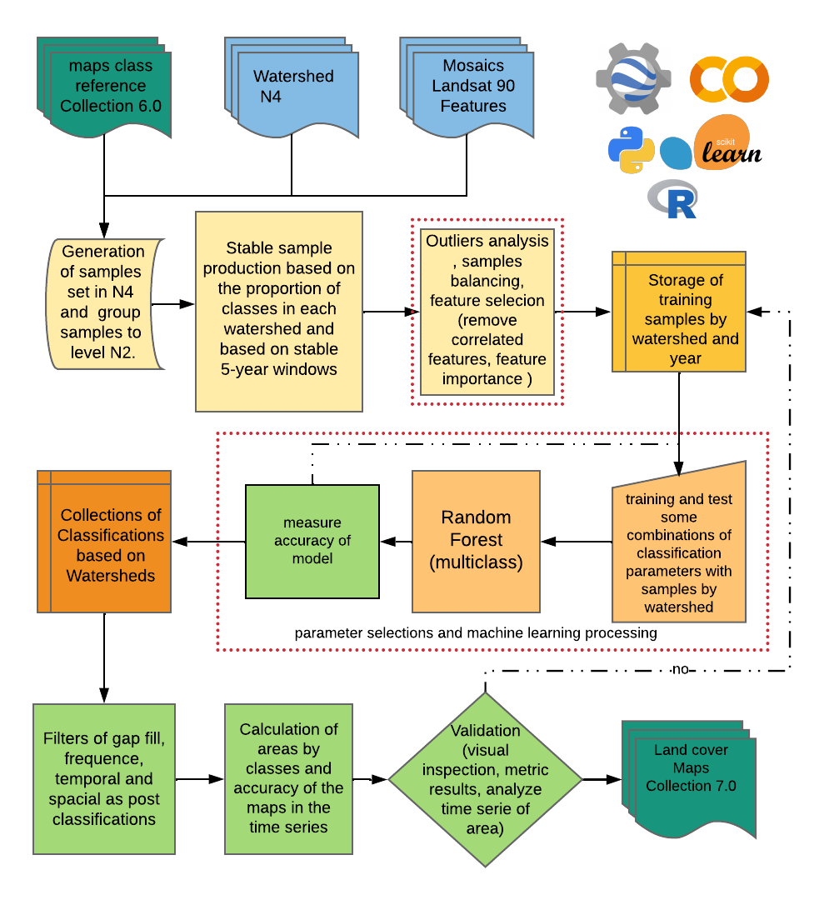
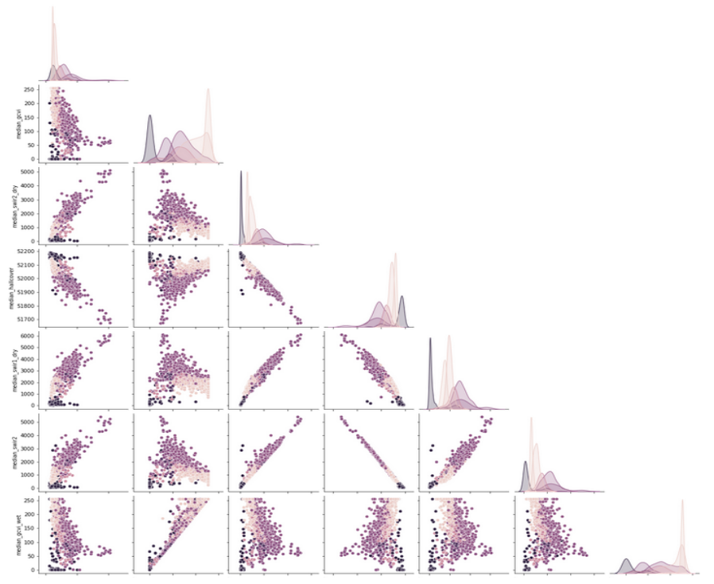

# Mapping methodology of Land Used Land Cover mapping of 37 years on project Mapbiomas/ Biome Caatinga

In this repository we share a set of scripts that were used for the construction of the use and coverage maps of the Caatinga biome in the 7.0 collection of the Mapbiomas project. The Maps were created from the Mapbiomas mosaics. Each mosaic corresponding to a year within the 1985-2021 series was trimmed by the limits of Hydrographic Basins of Brazil at level 2, figure 1. Some hydrographic basins were raised to level 3 in order to facilitate the Google Earth Engine api calculations.


<p align="center">
    
</p>
Figure 1: Limits of hydrographic basins in levels 2 and 4, and and limit of caatinga biome.

The classes produced in this work correspond to level 3, available in:

> https://mapbiomas.org/codigos-de-legenda?cama_set_language=pt-BR


The category of class of land cover are listed below with the nomenclature, the class number  and the color corresponding in the serie maps .

<p align="center">
    
</p>

Table 1: Legend of the classified classes.

The flow of the mapping process is explained in figure 2 below:

<p align="center">
    
</p>
Figure 2: Classification process of Mapbiomas current collection (1985-2021) in the Caatinga Biome.

### SUMMARY
* -- Collection of training samples
* -- Feature selection
* -- Parameter analysis for Random Forest
* -- Classification of Images Collection with Random Forest
* -- Validation of Results

## Building mosaic Landsat 
The mosaic was building with the Landsat images Collections 2 ST products. This collections 2 of Landsat was created with the Landsat Ecosystem Disturbance Adaptive Processing System (LEDAPS) algorithm (version 3.4.0) available on GEE. The mosaic was saved in the asset project Mapbiomas with all processing to get the data cleaned, it is accessed by path “projects/nexgenmap/MapBiomas2/LANDSAT/BRAZIL/mosaics-2”. This mosaic has 119 spectral bands between spectral indexes, fractions from spectral unmixing and descriptive statistics calculated by period  dry and wet, and the time serie of mosaic have 37 year. The access can be load this:
```
python

class ClassMosaic_indexs_Spectral(object):

    # default options
    options = {
        "bandas": ['B2', 'B3', 'B4', 'B8', 'B9', 'B11', 'B12', 'MSK_CLDPRB'],
        'classMapB': [3, 4, 5, 9, 12, 13, 15, 18, 19, 20, 21, 22, 23, 24, 25, 26, 29, 30, 31, 32, 33,
                      36, 39, 40, 41, 46, 47, 48, 49],
        'classNew':  [3, 4, 3, 3, 12, 12, 15, 18, 18, 18, 18, 22, 22, 22, 22, 33, 29, 22, 33, 12, 33,
                      18, 18, 18, 18, 18, 18, 18, 4],
        'asset_baciasN4': 'projects/mapbiomas-workspace/AMOSTRAS/col7/CAATINGA/bacias_hidrografica_caatingaN4',
        'outAsset': 'projects/mapbiomas-workspace/AMOSTRAS/col7/CAATINGA/ROIsXBaciasBalv7/',
        'assetMapbiomasGF': 'projects/mapbiomas-workspace/AMOSTRAS/col6/CAATINGA/classificacoes/classesV5',
        'assetMapbiomas': 'projects/mapbiomas-workspace/public/collection6/mapbiomas_collection60_integration_v1',
        'asset_mosaic_mapbiomas': 'projects/nexgenmap/MapBiomas2/LANDSAT/BRAZIL/mosaics-2',
        "anoIntInit": 1985,
        "anoIntFin": 2021,
    }
    lst_properties = arqParam.allFeatures
    def __init__(self, lst_year):

        self.imgMosaic = ee.ImageCollection(self.options['asset_mosaic_mapbiomas']).filter(
            ee.Filter.eq('biome', 'CAATINGA'))

    .
    .
    .

```

## Collection of training samples

- *The collection of training samples* is divided into 2 important parts:
* - sampling methods 
* - removal of points outliers

*Reference samples* for classification are collected from the map series in the most recent collection of Mapbiomas, in this case colection 6.0. To collect points with a certain level of veracity confidence per map year, a layer of stable pixels with 5 years of maps is created. Two years before the year under study and two years later. The sampling process for areas large in google earth engine (GEE) is a computationally expensive task, that is why in this work small areas were selected at level 4 watershed. The level 4 watershed has 320 regions, then this sampling process was automated using the api python of GEE. For this, modify the input parameters in the dictionary in the script pontos_balanceadosv2.py.

```python
for item in lsBacias[:]:

    if item not in baciasFeitas:

        print("fazendo bacia " + item)

        baciaTemp = ftcol_bacias.filter(
            ee.Filter.eq('nunivotto3', item)).first()
        # geobacia, colAnos, nomeBacia, dict_nameBN4
        objetoMosaic_exportROI.iterate_bacias(baciaTemp.geometry(
        ),  newColectAnos[indexIni: indexFin + 2], item,  dict_lstBacias)

        print("salvando ROIs bacia: << {} >>".format(item))
```

for each watershed level N2 is called the object *ClassMosaic_indexs_Spectral*  in this class each points sample for year mosaic is collected and exported by watershed level N2.

Remove Outliers is a good technique for cleaning data in the preprocessing step. The outliers pixels of each coverage class are removed using a clustering algorithm “ee.Clusterer.wekaLVQ" implemented in the Google Earth Engine of the article PELLEG and MOORE, 1998. 

> ==> run: python filtroOutlierAmostras.py

The parameters of cluster was:
```python
    'pmtClustLVQ' : { 
        'numClusters': 8, 'learningRate': 0.000005, 'epochs': 800
        }
```


<p align="center">
    
</p>
Figure 3: Visualization of the result of removing outliers before and after.


## Feature selection

For the construction of the use and coverage maps of the Mapbiomas project, annual analytical mosaics are used. These mosaics have a Feature Space of 102 bands. The selection of the bands to be used in a classification by Machine Learning is fundamental for a good performance of the classification algorithm as well as decreasing the processing time. For this analysis, all points previously collected are downloaded from asset GEE, in CSV format. These have information from each of the bands in the mosaic. The method to know which bands of the mosaic are most important is used the function [feature_importances_] of the model implemented in the python sklearn library, for more information [visit scikit-learn](https://scikit-learn.org/stable/modules/generated/sklearn.ensemble.RandomForestClassifier.html?highlight=sklearn%20ensemble#sklearn.ensemble.RandomForestClassifier):

A first feature space selection strategy was to filter out all the features that were highly correlated with each other. With this step all highly correlated spectral bands would be considered redundant. See figure 4. 

<p align="center">
    
</p>
Figure 4: Visualization of correlation matrix of feature space.

In feature analysis it is important to understand how variables are distributed in space. Visual exploration is an essential component of data analysis, it allows you to visually arrive at intuitions and hypotheses about the structure and distribution in space. Visual analysis allows you to develop some approaches to obtain or quantify such an understanding of the data, KEIM <i> et al. <\i> 2010. Pair combinations help a bit to visually understand the complexity of separating classes within the space used. See figure 5. 

<p align="center">
    
</p>
Figure 5: Visualization scatter plot of samples by feature pairs .